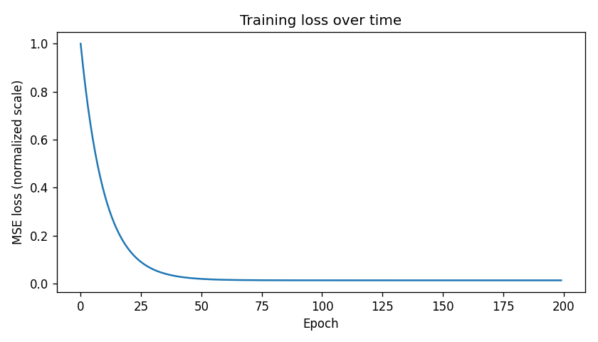
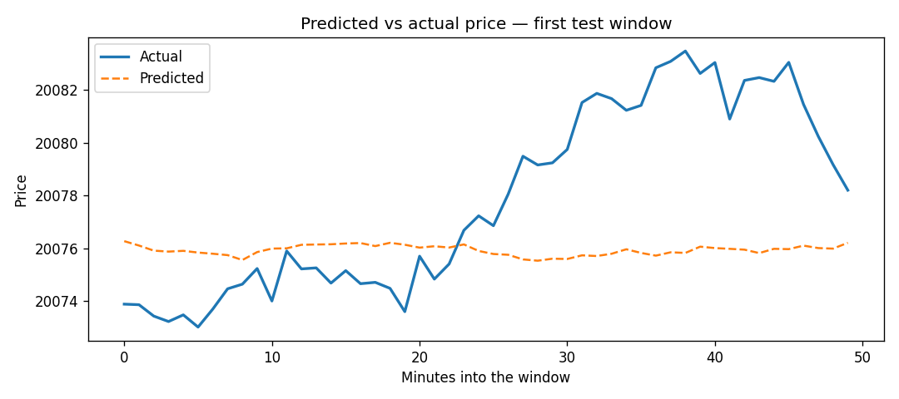

# NIFTY Intraday Price Prediction (Built From Scratch, No Training Wheels)

Predicting the stock market is everyone's favorite impossible problem. I'm not claiming to have cracked it -- but I did build a full price-prediction pipeline using raw NumPy, with zero help from scikit-learn or any ML framework, just to prove I actually understand what's happening when a model "learns," instead of trusting a library to do it for me.

No magic `.fit()` call. No black box. Just gradient descent, written by hand, one line at a time -- and tested against numbers I worked out on paper before I ever trusted the code.

## What it actually does

Feed it a chunk of past NIFTY 50 prices, and it tries to guess what the next chunk looks like. Under the hood it's plain linear regression -- the simplest model that exists -- trained with hand-rolled batch gradient descent. Forward pass, loss, gradient, update. Every step is visible. Nothing is hidden behind an import.

## The pipeline

```
1. Load & sort raw prices          - clean, time-ordered price history
2. Chop into (look, guess) pairs   - past prices in, future prices out
3. Train/test split (time-aware)   - no shuffling, no peeking at the future
4. Normalize (train stats only)    - keeps gradient descent from going haywire
5. Train                           - guess - measure the damage -- nudge weights -- repeat
6. Predict on data it's never seen - un-normalize back to real prices
7. Score it                        - MAE, RMSE, R^2, correlation
```

## Why the hard way

Anyone can write `LinearRegression().fit(X, y)` in one line. That's great if you just want an answer -- useless if you want to actually understand what happened to get there. I wanted the second thing. So every gradient here is derived and coded by hand.

## Project layout

```
nifty_price_prediction/
src/nifty_prediction/
│   ├── data.py        # load_prices — CSV loading, chronological sort
│   ├── windowing.py   # make_windows — slice series into (look, guess) pairs
│   ├── split.py        # train_test_split_by_time — time-respecting split
│   ├── normalize.py   # compute_norm_stats, apply_norm, undo_norm
│   ├── model.py       # LinearWindowModel — forward pass + training loop
│   ├── evaluate.py    # evaluate — MAE / MSE / RMSE / R² / correlation
│   └── pipeline.py    # run_pipeline — wires every stage together, CLI entry point
├── examples/
│   └── generate_demo_assets.py   # regenerates the plots/numbers in this README
└── assets/              # generated plots
```

## Get it running

```bash
git clone <your-repo-url>
cd nifty_price_prediction
pip install -e .
pip install matplotlib pytest 
```

Try it instantly on fake data:
```bash
python -m nifty_prediction.pipeline --synthetic
```

Or point it at real prices:
```bash
python -m nifty_prediction.pipeline --csv NIFTY_INTRADAY_2026.csv \
    --window-size 1875 --epochs 100 --lr 1e-5
```

Or use it as a library:
```python
from nifty_prediction.pipeline import run_pipeline

result = run_pipeline("your_data.csv", window_size=1875, epochs=100, lr=1e-5)
print(result["metrics"])
```

## Results (on fake data, for now)

Real NIFTY intraday data isn't checked into this repo — it's a big file, and dumping multi-megabyte CSVs into git history is how you end up hating your own repo six months later. So these numbers come from a synthetic random-walk series, purely to prove the pipeline runs end to end correctly.

| Metric | Value |
|---|---|
| MAE | 4.33 |
| RMSE | 5.64 |
| R² | 0.9495 |
| Correlation | 0.9748 |




## The part where I keep myself honest

An R² of 0.95 sounds like I cracked the market. I didn't. Stock prices are close to a random walk, so a model that just assumes "whatever's been happening will keep happening for a few more minutes" can score deceptively well without knowing anything real. If someone shows you a price-prediction model with great numbers and no comparison to a dumb baseline, be suspicious — I'd rather flag that myself than have someone else catch it.

A few other things worth knowing before you take this too seriously:
- It predicts a whole future window, not just the next tick — a harder, less standard problem than most forecasting benchmarks use.
- A single linear layer has no real concept of time — it just sees a flat pile of numbers. It can't tell a genuine trend from noise.
- This is a learning project, not a trading strategy. Please don't put real money behind it. I won't either.

## Bugs I found while building this (and fixed)

Nobody writes gradient descent correctly on the first try — including me. This was built and debugged one function at a time, checking each stage against hand-calculated numbers before moving to the next. A few of the more interesting mistakes, now permanently caught by tests so they can't quietly come back:

- Sorted dates as plain text instead of real `datetime` objects — silently scrambled chronological order for certain date formats. No crash, just a wrong answer, which is the scary kind of bug.
- Forgot to divide the weight gradient by batch size, so `grad_W` and `grad_b` ended up scaled inconsistently — invisible with a single training sample, obvious the moment there were two.
- Price dtype quietly depended on whether the source CSV happened to have decimal points, instead of being guaranteed.
